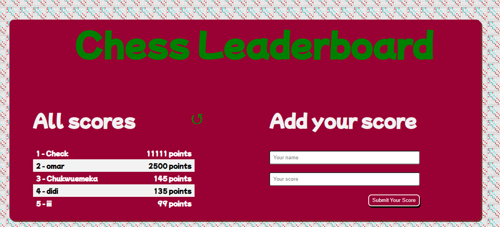

<a name="readme-top"></a>

<!--
HOW TO USE:
This is an example of how you may give instructions on setting up your project locally.

Modify this file to match your project and remove sections that don't apply.

REQUIRED SECTIONS:
- Table of Contents
- About the Project
  - Built With
  - Live Demo
- Getting Started
- Authors
- Future Features
- Contributing
- Show your support
- Acknowledgements
- License

OPTIONAL SECTIONS:
- FAQ

After you're finished please remove all the comments and instructions!
-->

<div align="center">
  <!-- You are encouraged to replace this logo with your own! Otherwise you can also remove it. -->
  
  <br/>

  <h3><b>Microverse README Template</b></h3>

</div>

<!-- TABLE OF CONTENTS -->

# 📗 Table of Contents

- [📖 About the Project](#about-project)
  - [🛠 Built With](#built-with)
    - [Tech Stack](#tech-stack)
    - [Key Features](#key-features)
  - [🚀 Live Demo](#live-demo)
- [💻 Getting Started](#getting-started)
  - [Setup](#setup)
  - [Prerequisites](#prerequisites)
  - [Install](#install)
  - [Usage](#usage)
  - [Run tests](#run-tests)
  - [Deployment](#triangular_flag_on_post-deployment)
- [👥 Authors](#authors)
- [🔭 Future Features](#future-features)
- [🤝 Contributing](#contributing)
- [⭐️ Show your support](#support)
- [🙏 Acknowledgements](#acknowledgements)
- [❓ FAQ (OPTIONAL)](#faq)
- [📝 License](#license)

<!-- PROJECT DESCRIPTION -->

# 📖 Leaderboard  <a name="about-project"></a>

**Leaderboard** is an app designed to display all scores in a chess game with highest scores occupying the first position.


## 🛠 Built With <a name="built-with"></a>
### Tech Stack <a name="tech-stack"></a>

<details>
  <summary>HTML</summary>
  <ul>
    <li><a href="https://developer.mozilla.org/en-US/docs/Web/HTML">Link to HTML</a></li>
  </ul>
</details>

<details>
  <summary>CSS</summary>
  <ul>
    <li><a href="https://developer.mozilla.org/en-US/docs/Web/CSS">Link to CSS</a></li>
  </ul>
</details>

<details>
  <summary>Javascript</summary>
  <ul>
    <li><a href="https://www.javascript.com/">Link to Javascript</a></li>
  </ul>
</details>
<!-- Features -->

### Key Features <a name="key-features"></a>

- **This Project has a Readme.md file**
- **This Project has a gitignore file**
- **This projects follows all Microverse Linters**
- **This project takes user inputs of names and scores**
- **This project displays the input for name and scores in the recent scores box**
- **This project saves the score details to an API**
- **This project fetches the score details from an API**
- **This project has syntax with ES6 format.**


<p align="right">(<a href="#readme-top">back to top</a>)</p>

<!-- LIVE DEMO -->

## 🚀 Live Demo <a name="live-demo"></a>

<!-- > Add a link to your deployed project. -->

- [Live Demo Link](https://donmark2k.github.io/leaderboard/dist/)

## Project Screenshots



<p align="right">(<a href="#readme-top">back to top</a>)</p>

<!-- GETTING STARTED -->

## 💻 Getting Started <a name="getting-started"></a>

### Prerequisites

In order to run this project you need:
- [git](https://git-scm.com/downloads): A tool for managing source code
- [Visual Studio Code](https://code.visualstudio.com/): A source code editor
- Have a working and updated browser
- Have a local version control like git installed on your computer
- A copy of the link of this Repository.
```sh
 https://github.com/Donmark2k/leaderboard.git
```

### Setup
Clone this repository to your desired directory using the command: 

```sh
  cd your-folder
  git clone https://github.com/Donmark2k/leaderboard.git 
```

### Install

Install the required dependencies using the following command:

```sh
  npm install
```
### Usage
Run the server using the following command:

```sh
  npm start
```
### Run tests
Run this command to fix some CSS linters error
```sh
  npx stylelint "**/*.{css,scss}" --fix
``` 
Run this command to fix some JavaScript linters error
```sh
  npx eslint . --fix
```

<p align="right">(<a href="#readme-top">back to top</a>)</p>

<!-- AUTHORS -->

## 👥 Author <a name="authors"></a>

 👤**Chukwuemeka Ochuba**

- GitHub: [@Donmark2k](https://github.com/Donmark2k)
- Twitter: [@Donmark2k](https://twitter.com/donmark2k)
- LinkedIn: [LinkedIn](https://www.linkedin.com/in/chukwuemeka-ochuba/)


<p align="right">(<a href="#readme-top">back to top</a>)</p>

<!-- FUTURE FEATURES -->

## 🔭 Future Features <a name="future-features"></a>

- [ ] **[User Sign In and interactions]**
- [ ] **[Fan comments and votes]**
- [ ] **[Various Game details like opponent and rounds]**


<p align="right">(<a href="#readme-top">back to top</a>)</p>

<!-- CONTRIBUTING -->

## 🤝 Contributing <a name="contributing"></a>

Contributions, issues, and feature requests are welcome!

Feel free to check the [issues page](https://github.com/Donmark2k/leaderboard/issues).

<p align="right">(<a href="#readme-top">back to top</a>)</p>

<!-- SUPPORT -->

## ⭐️ Show your support <a name="support"></a>

- Give a ⭐️ if you like this project!

<p align="right">(<a href="#readme-top">back to top</a>)</p>

<!-- ACKNOWLEDGEMENTS -->

## 🙏 Acknowledgments <a name="acknowledgements"></a>

I would like to appreciate [Microverse](https://www.microverse.org/) for providing the resources and the platform for us to be a Professional full-stack developer.

<p align="right">(<a href="#readme-top">back to top</a>)</p>

<!-- FAQ (optional) -->

## ❓ FAQ (OPTIONAL) <a name="faq"></a>

- **Are Leaderboard fair?**

  - Leaderboard aim to be fair by ranking participants based on objective criteria. 

- **How can I get on a leaderboard?**

  - To get on a leaderboard, you need to participate in the competition associated with it.


<p align="right">(<a href="#readme-top">back to top</a>)</p>

<!-- LICENSE -->

## 📝 License <a name="license"></a>

This project is [MIT](MIT.md) licensed.

<p align="right">(<a href="#readme-top">back to top</a>)</p>
